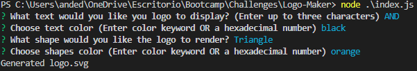
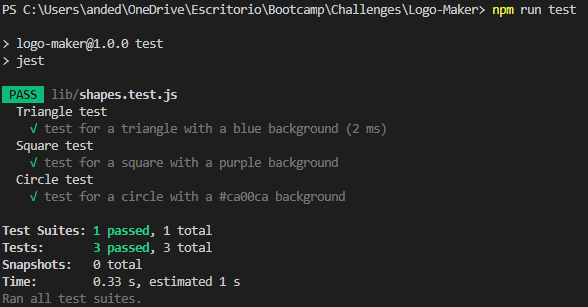

# Logo-Maker

## Table of Contents

 * [Description](#description)

 * [Screenshots](#screenshots)

 * [Technologies-Used](#technologies-used)

 * [Installation](#installation)

 * [Test-Instructions](#test-instructions)

 * [License](#license)

 * [Questions](#questions)

## Description

This is LOGO MAKER APP, when you will can create your personal or favorite logo using our easy aplication. You can customize the type of figure, text, background color, text color and after your preferences, this app will generate a logo .SVG.

## Screenshots

Logo Generation

Examples of Generated Logos

## Technologies Used

 - Node.js v20.2.0 
 - inquirer v8.2.4
 - jest v29.5.0

## Installation

1. Clone the repo:
   git clone https://github.com/andedu15/Logo-Maker

2. Open in VS Code. If you do not have VS code you must install it.

3. Using the terminal, install node.js v20.

4. Once node.js v20 is installed, in the terminal, utilize the command npm init -y to initialize and create a package.json where project files will be stored.

5. Next, use the terminal to run the command npm i to install the dependencies associated with this application (developers may need to install inquirer and jest directly from the command line, to do so the command for inquirer will be npm i inquirer@8.2.4 to install v8.2.4 of the inquirer, and npm i jest to install the latest version of jest).

6. To run the application, within the terminal, type the command node index.js.

## Test Instructions

To run unit testing, open the terminal, and use the command npm run test.

## License

This application is covered under the MIT License

## Questions

[Andres's Github](https://github.com/andedu15)

<a href="mailto:mejiandrese15@gmail.com">mejiandrese15@gmail.com</a>
